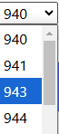
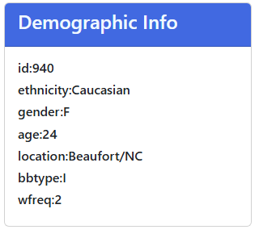
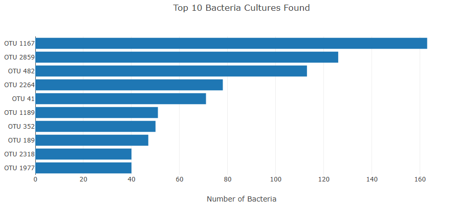
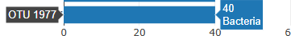
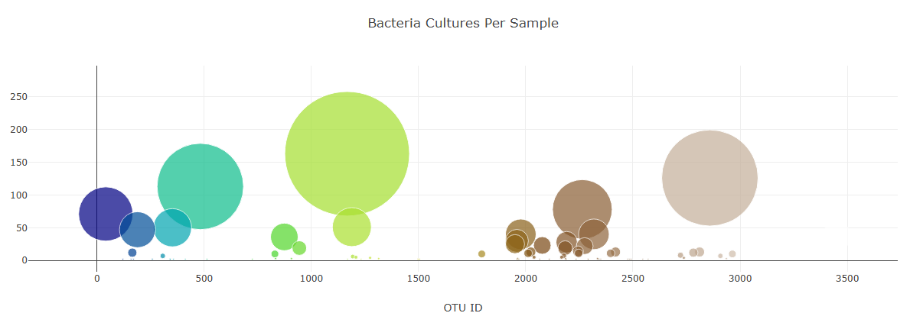
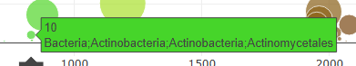
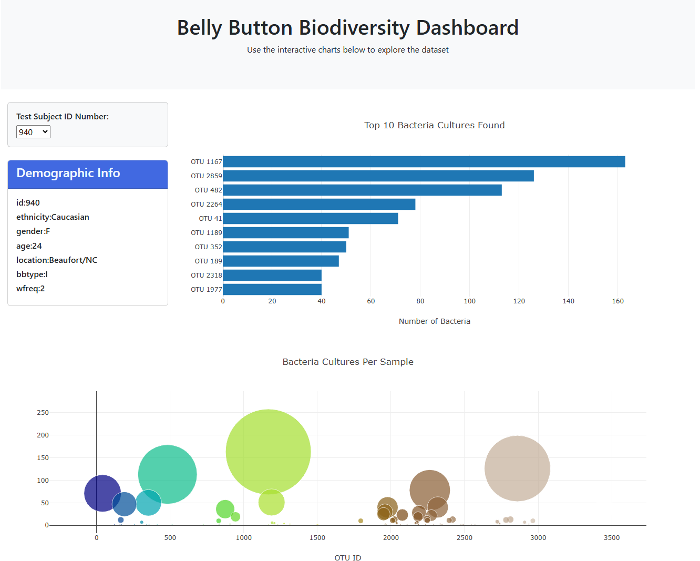

# belly-button-challenge
##  Module 14 Challenge
---
 - `This repository will illustrate skills in building an interactive dashboard to explore the belly button biodiversity dataset. D3.js with be used for the interactive data visualizations in homepage`

 ---

-  Repository file structure:
    - root:
        -   index.html -Homepage
        -   README.md -Basic information about the repository
        -   static folder:
            - style.css - stylesheet for index.html
            - samples.json -Reference to the dataset being requested by the API call.
            - README Resources folder -Contains README.md picture.
            - js folder:
                - .gitkeep
                - `app.js` - main javascript using D3 library for homepage interactive data visualization.

 ---
  ### Building a web site with interactive dashboard

  - Layout
    - Dropdown menu.
    
    
    

    - Sample's metadata display.
    
    
    - Horizontal bar chart displaying the top 10 OTUs from sample selected in dropdown menu.
    
        - Values for bar chart: sample_values
        - Label for the bar chart: otu_ids

             
             - Hovertext: otu_labels

    - Bubble chart displaying each sample
    
        - x axis values: otu_ids
        - y axis values: sample_values
        - marker size value: sample_values
            
            - Hovertext: otu_labels

website: [HERE]

    

    
    

  

                            